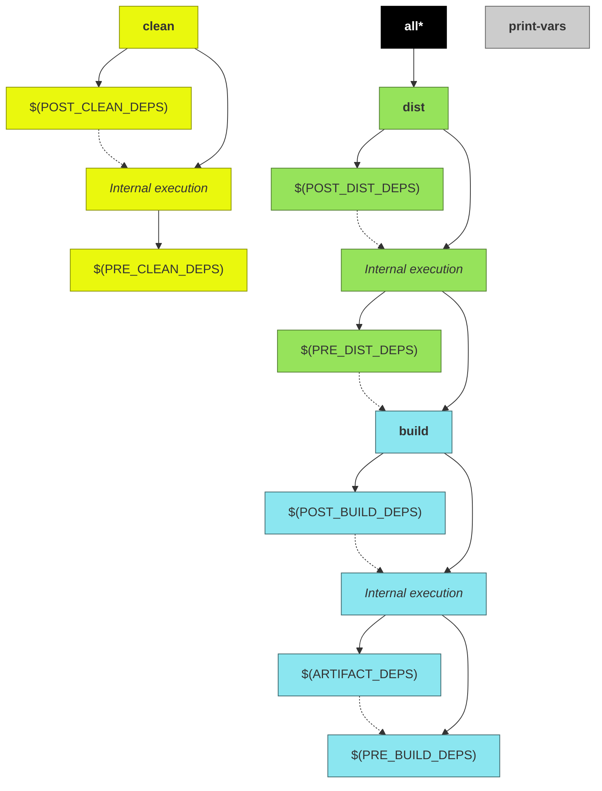

# builder.mk

This is the main makefile exposed by the cpp-project-builder. It contains standard recipes to build C/C++/Assembly multiplatform projects using a GCC-based compiler.

> **Assumptions**
>
> * Although complex arrangements can be made using the build system, in order make easier the explanation of the concepts, it will be assumed a project containing a single makefile responsible by the compilation/distribution process.
>
> * From this point onwards, the project source root directory will be referred as `$(PROJ_ROOT)` and this is the directory where project's main makefile is located.
>
> * The directory where build system is installed will be referred as `$(CPP_PROJECT_BUILDER)`.

## Summary

- [builder.mk](#buildermk)
  - [Summary](#summary)
  - [Default directories](#default-directories)
  - [Output directories](#output-directories)
  - [Multiplatform projects](#multiplatform-projects)
    - [Layer directories and files](#layer-directories-and-files)
    - [CROSS_COMPILE variable](#cross_compile-variable)
  - [Make targets](#make-targets)
  - [Variables](#variables)
    - [Command-line variables](#command-line-variables)
    - [Read-only variables](#read-only-variables)
    - [Makefile-exclusive variables](#makefile-exclusive-variables)
    - [Compiler management](#compiler-management)
    - [Advanced Variables](#advanced-variables)

## Default directories

When present, these directories will be used (by default) with the following purposes:

> NOTE: `$(PROJ_ROOT)` does not accept whitespaces

* **`$(PROJ_ROOT)/include/`**

  Contains platform-independent public includes (header files) used by application during build.

  This directory will be added to compiler's [include search path](#INCLUDE_DIRS).

  By default, if project is a [library](#PROJ_TYPE), all files contained in this directory will be copied to the [output-directories](#output-directories).

  > **Skip default include source directory**
  >
  > THIS IS A FEATURE OF LAST RESORT!
  >
  > Default include directory can be ignored by the build through the definition of [`SKIP_DEFAULT_INCLUDE_DIR`](#SKIP_DEFAULT_INCLUDE_DIR) variable.

* **`$(PROJ_ROOT)/src/`**

  Contains platform-independent source files and private headers used by application during build. Any kind of file can be placed into this directory, but only C/C++/Assembly source files will be compiled. The file types are identified according to filename suffixes (values are case-sensitive):

  * C sources:**.c**
  * C++ sources: **.cpp**, **.cxx**, or **.cc**
  * Assembly sources: **.s** or **.S**

  This directory is also added to compiler's [include search path](#INCLUDE_DIRS).

  > **Skip default source directory**
  >
  > THIS IS A FEATURE OF LAST RESORT!
  >
  > Default source directory can be ignored by the build system through the definition of  [`SKIP_DEFAULT_SRC_DIR`](#SKIP_DEFAULT_SRC_DIR) variable.

* **`$(PROJ_ROOT)/hosts/`**

  This directory is assumed to contain platform layers for the project.

  For details regarding platform layers, see [multiplatform projects](#multiplatform-projects).

  > **Skip default hosts directory**
  >
  > THIS IS A FEATURE OF LAST RESORT!
  >
  > Default hosts directory can be ignored by the build system through the definition of [`SKIP_DEFAULT_HOSTS_DIR`](#SKIP_DEFAULT_HOSTS_DIR) variable.

## Output directories

All generated-files produced by the building process are placed into an output base directory (defined by the variable [`O`](#O)). By default, this directory is located into `$(PROJ_ROOT)/output/`.

For example, in order to put output files into a directory named `/output/directory`, just override the `O` variable during the call to `make` by passing its value through command line arguments:

```sh
make O=/output/directory
```

> **Version control**
>
> The output base directory shall be ignored by your source code version control system if it is located inside your source tree.

Inside output base directory ([`$(O)`](#O)) you may find directories (some of them exists only for certain [types of projects](#PROJ_TYPE)) grouped by target host platform ([`$(HOST)`](#HOST)) and build mode ([debug or release](#DEBUG)):

* **`$(O)/$(HOST)/<debug-or-release>/build/`**

  Build directory. This directory contains object files as well as final artifact (application executable or library).

  This path can be obtained through [`O_BUILD_DIR`](#O_BUILD_DIR) read-only variable and customized through [`BUILD_SUBDIR`](#BUILD_SUBDIR) variable.

* **`$(O)/$(HOST)/<debug-or-release>/dist/`**

  Distribution directory. Final artifact (executable or library), and possibly companion files (e.g. header files, for libraries) are placed into this directory.

  This path can be obtained through [`O_DIST_DIR`](#O_DIST_DIR) read-only variable and customized through [`DIST_SUBDIR`](#DIST_SUBDIR) variable.

  > **Additional distribution files**
  >
  > Additional directories and/or files to be distributed along with resulting distribution can be added through usage of [`EXTRA_DIST_DIRS`](#EXTRA_DIST_DIRS) and [`EXTRA_DIST_FILES`](#EXTRA_DIST_FILES) variables.

  * **`$(O)/$(HOST)/<debug-or-release>/dist/bin/`**

    If project is an [application executable](#PROJ_TYPE), resulting distribution binary will be placed into this directory.

  * **`$(O)/$(HOST)/<debug-or-release>/dist/lib/`**

    If project is a [library](#PROJ_TYPE) (either [static or shared](#LIB_TYPE)), resulting binary will be placed into this directory.

  * **`$(O)/$(HOST)/<debug-or-release>/dist/include/`**

    If project builds a [library](#PROJ_TYPE) (either [static or shared](#LIB_TYPE)), public headers (if any) will be placed into this directory.

## Multiplatform projects

The build system was created with the concept of platform layers in mind, which means that platform customizations can be made by adding a specifc layer on top of a generic one.

In order to clarify the concepts, lets assume an example project which will be supporting the following hosts: `linux-x64`, and `linux-arm-v7`. For this example project, the following layers can be added (note that layer arrangement is up to the developer):

* `linux`
* `linux-x64` (applied on top of `linux` layer)
* `linux-arm` (applied on top of `linux` layer)
* `linux-arm-v7` (applied on top of `linux-arm-v7` layer)

> NOTE: layer components must be delimited by a dash (`-`)

If you are compiling this example project to `linux-arm-v7` host, select the compilation host through [`HOST`](#HOST) variable. The recommended way is to set the variable through a command line paramenter (although is perfectly legal to hardcode a value into a `$(PROJ_ROOT)/Makefile`):

```sh
$ make HOST=linux-arm-v7
```

During the build, the following layers will be applied to this project:

* `linux`
* `linux-arm` (applied on top of `linux` layer)
* `linux-arm-v7` (applied on top of `linux-arm-v7` layer)

> Note that `linux-x64` layer will be skipped when building the for this host, since it is not a compatible layer.

Similarly, when building to `linux-x64` host, set the [`HOST`](#HOST) variable during the build:

```sh
$ make HOST=linux-x64
```
And the following layers will be applied:

* `linux`
* `linux-x64` (applied on top of `linux` layer)

> Note that `linux-arm` and `linux-arm-v7` layers will be skipped when building the for this host, since they are not compatible layers.

### Layer directories and files

For each supported layer, there is expected to be a subdirectory inside [hosts directory](#default-directories) with its name corresponding to the layer. This location can contain any files/subdirectories, but the following ones have special meaning for the build system:

<a name="layer-src-dir"></a>
* **`$(PROJ_ROOT)/hosts/<layer-name>/src/`**

  If present, this directory is expected to contain layer-specific source files, which will be compiled when layer is compatible with selected [`HOST`](#HOST).

  > This directory will also be added to compiler's [include search path](#INCLUDE_DIRS).

<a name="layer-host-mk"></a>
* **`$(PROJ_ROOT)/hosts/<layer-name>/host.mk`**

  If present, this makefile will be autoamtically included by the build system when layer is compatible with selected [`HOST`](#HOST). This is useful to add custom build flags and/or libraries for chosen layer.

  For example, while building a project (which has custom makefiles for the layers `linux`, `linux-arm` and `linux-arm-v7`) for the host `linux-arm-v7`, the following sequence of includes will be performed automatically by the build system:

  1. `include $(PROJ_ROOT)/hosts/linux-arm-v7/host.mk`
  2. `include $(PROJ_ROOT)/hosts/linux-arm/host.mk`
  3. `include $(PROJ_ROOT)/hosts/linux/host.mk`

### CROSS_COMPILE variable

When building for a custom target host other than native one, it is required to set the [`CROSS_COMPILE`](#CROSS_COMPILE) variable. This variable must contain the prefix to be added to toolchain binaries. For example, `g++` on a toolchain for `linux-arm` may be called `linux-arm-g++`. In this example, `CROSS_COMPILE` shall be equal to `linux-arm-` (NOTE the trailing dash).

## Make targets

The following diagram shows all targets exposed by this makefile and their dependencies:

> NOTE: Dashed arrows represent execution of one target after another (target pointed by the arrow is executed before the target at arrow base), and not a dependency between targets.



<a name="all"></a>
* **`all`**

  Default target. Just depends on [dist](#dist) target.

<a name="clean"></a>
* **`clean`**

  Removes all compiled artifacts.

  Its internal rules are preceeded by the targets declared in [`PRE_CLEAN_DEPS`](#PRE_CLEAN_DEPS) variable, and are followed by the targets declared in [`POST_CLEAN_DEPS`](#POST_CLEAN_DEPS) variable.


<a name="build"></a>
* **`build`**

  Compiles all source files and generates the target binary artifact (executable application or library).

  Its internal rules are preceeded by the targets declared in [PRE_BUILD_DEPS](#PRE_BUILD_DEPS) variable, and are followed by the targets declared in [`POST_BUILD_DEPS`](#POST_BUILD_DEPS) variable.

  > **NOTES**
  >
  > * If project does not contain source files, no binary artifact will be generated (Howerver, targets declared in [PRE_BUILD_DEPS](#PRE_BUILD_DEPS) and [`POST_BUILD_DEPS`](#POST_BUILD_DEPS) will be executed)
  >
  > * Additional dependency targets for the binary artifact may be added through the [ARTIFACT_DEPS](#ARTIFACT_DEPS) variable.

<a name="dist"></a>
* **`dist`**

  Generate distribuition tree.

  Its internal rules are preceeded by the targets declared in [PRE_DIST_DEPS](#PRE_DIST_DEPS) variable, and followed by dependencies declared on [POST_DIST_DEPS](#POST_DIST_DEPS) variable.

  > See [`EXTRA_DIST_DIRS`](#EXTRA_DIST_DIRS) and [`EXTRA_DIST_FILES`](#EXTRA_DIST_FILES) in order to check how to add extra files/directories to the distribution.

<a name="print-vars"></a>
* **`print-vars`**

  This target is used mostly for debugging purposes. It prints the contents of the variables declared in variable [`VARS`](#VARS).

  For example, to get the value of both [`SRC_DIRS`](#SRC_DIRS) and [`SRC_FILES`](#SRC_FILES):

  ```sh
  $ make print-vars VARS='SRC_DIRS SRC_FILES'
  ```

  Generates the following output (for [c-app demo](../demo/c-app)):

  ```
  SRC_DIRS = src
  SRC_FILES = src/main.c
  ```

## Variables

The build system provided by this makefile uses special defined variables in order to customize how project is built.

Some variables are expected to be defined exclusively on any or your project's makefiles, some of them are recommended to be defined on command line, and others are read-only (i.e. contains utility information generated by the build system and cannot be modified by the user/project).

All supported variables are described below:

> **Variable details**
>
> For each detailed variable, the following fields refer to:
>
> * **Description:** contains descriptive information about the variable.
> * **Mandatory:** defines if a variable must be defined during build.
> * **Default value:** contains the value which will be assumed if variable is optional and it is not defined (NOTE that the default value may not be available during [plaform layer](#multiplatform-projects) customizations).
> * **Ready for layers:** defines if variable values are can be assumed as fully defined during platform layer customizations (e.g. default value for [`INCLUDE_DIRS`](#INCLUDE_DIRS) variable will be applied only after layers were parsed).
> * **Allowed origins:** defines where variable is allowed to be defined (command line, environment, file, etc).
> * **Restrictions:** Contain information about restrictions on which kind of values that can be stored in the variable.

### Command-line variables

Here are listed variables that can be perfectly defined inside a makefile, although is strongly recommeded that they should be defined as command-line parameters during `make` invocation in order to achive maximum flexibility during build:

<a name="DEBUG"></a>
* **`DEBUG`**
  * **Description:** Enables/Disables the debug mode for the build.
    * While bulding in debug mode (`DEBUG == 1`), debug symbols will be added to generated binary artifact.
    * In release mode (`DEBUG == 0`), this extra information is (by default) [stripped-out](#STRIP_RELEASE) from generated binary and [compiler optimizations](#OPTIMIZE_RELEASE) will be applied during building process.
  * **Mandatory:** no
  * **Default value:** `0`
  * **Ready for layers:** yes
  * **Allowed origins:** _Any, although it is strongly recommended to define this variable through command-line parameters._
  * **Restrictions:** Accepted values are **`1`** (enable debug mode) or **`0`** (disables debug mode / enables release mode).

<a name="HOST"></a>
* **`HOST`**
  * **Description:** Sets the target host for compilation (see [multiplatform projects](#multiplatform-projects)).
  * **Mandatory:** no
  * **Default value:** _Native host identified by [native-host.mk](native-host.mk.md) or value is left undefined if native host was not detected._
  * **Ready for layers:** yes
  * **Allowed origins:** _Any, although it is strongly recommended to define this variable through command-line parameters._
  * **Restrictions:** Any single word string.
    * NOTE that dashes are used to factorize host and identify compatible [platform layers](#multiplatform-projects)).
    * When defined, value cannot be empty.

<a name="LIB_TYPE"></a>
* **`LIB_TYPE`**
  * **Description:** For library projects ([`PROJ_TYPE`](#PROJ_TYPE) `== lib`), defines the type of generated library.
    * Its value will be used to set the name of [final artifact](#ARTIFACT) if it is left undefined (on linux, osx, and windows hosts).
  * **Mandatory:** no
  * **Default value:** `shared`
  * **Ready for layers:** no
  * **Allowed origins:** _Any, although it is strongly recommended to define this variable through command-line parameters._
  * **Restrictions:** Accepted values are **`static`** (for a static library) or **`shared`** (for a shared library)

<a name="O"></a>
* **`O`**
  * **Description:** Sets the name of the [base output directory](#output-directories), where all generated artifacts will be placed into.
  * **Mandatory:** no
  * **Default value:** `output`
  * **Ready for layers:** yes
  * **Allowed origins:** _Any, although it is strongly recommended to define this variable through command-line parameters._
  * **Restrictions:** Value shall not contain whitespaces nor can be an empty string.

<a name="V"></a>
* **`V`**
  * **Description:** Enables/Disables the verbose mode.
    * When enabled, each compiler command executed by the build system will be displayed in standard output during `make` command invocation.
  * **Mandatory:** no
  * **Default value:** `0`
  * **Ready for layers:** yes
  * **Allowed origins:** _Any, although it is strongly recommended to define this variable through command-line parameters._
  * **Restrictions:** Accepted values are **`1`** (enables verbose mode) or **`0`** (disables verbose mode).

<a name="VARS"></a>
* **`VARS`**

  * **Description:** Contains a list of variable names to inspec through [`print-vars`](#print-vars) target.
    * For example, to get the values of `SRC_DIRS` and `SRC_FILES` variables just call make:
      ```sh
      make print-vars VARS='SRC_DIRS SRC_FILES'
      ```
  * **Mandatory:** no
  * **Default value:** _A predefined list of variable names_
  * **Ready for layers:** no
  * **Allowed origins:** _Any, although it is strongly recommended to define this variable through command line parameters._
  * **Restrictions:** Value cannot be empty.

### Read-only variables

Some variables are generated by this makefile and cannot be modified:

<a name="O_BUILD_DIR"></a>
* **`O_BUILD_DIR`**
  * **Description:** Contains the path where compiled intermediate files (e.g. object files) are placed (see [output directories](#output-directories) and [`BUILD_SUBDIR`](#BUILD_SUBDIR)).
  * **Mandatory:** _(N/A: variable is set by the build system)_
  * **Default value:** _(N/A: variable is set by the build system)_
  * **Ready for layers:** yes
  * **Allowed origins:** _(N/A: variable is set by the build system)_
  * **Restrictions:** This is a read-only variable. Its value is set by this makefile and cannot be modified.

<a name="O_DIST_DIR"></a>
* **`O_DIST_DIR`**
  * **Description:** Contains the path where distribution files (e.g. artifact, library companion headers, etc) are placed (see [output directories](#output-directories) and [`DIST_SUBDIR`](#DIST_SUBDIR)).
  * **Mandatory:** _(N/A: variable is set by the build system)_
  * **Default value:** _(N/A: variable is set by the build system)_
  * **Ready for layers:** yes
  * **Allowed origins:** _(N/A: variable is set by the build system)_
  * **Restrictions:** This is a read-only variable. Its value is set by this makefile and cannot be modified.

<a name="O_VERBOSE"></a>
* **`O_VERBOSE`**
  * **Description:** Contains a prefix that can be placed before receipt commands in order to suppress/show the command being executed according to the value defined in [`$(V)`](#V).
    * Here is an example used to hide/show the invoked compiler command while bulding a C file:
      ```Makefile
      $(O_VERBOSE)$(CROSS_COMPILE)$(CC) $(strip $(CFLAGS) -c $< -o $@)
      ```
  * **Mandatory:** _(N/A: variable is set by the build system)_
  * **Default value:** _(N/A: variable is set by the build system)_
  * **Ready for layers:** yes
  * **Allowed origins:** _(N/A: variable is set by the build system)_
  * **Restrictions:** This is a read-only variable. Its value is set by this makefile and cannot be modified.

### Makefile-exclusive variables

The following variables must be defined exclusively inside a makefile (either `$(PROJ_ROOT)/Makefile` or any makefile included by the build system):

<a name="EXTRA_DIST_DIRS"></a>
* **`EXTRA_DIST_DIRS`**
  * **Description:** Contains a whitespace-separated list of extra directories containing files which will copied into [distribution directory](#O_DIST_DIR).
    * Each entry in this variable has the syntax `ORIGIN_DIR[:DEST_DIR]` (all files contained in `ORIGIN_DIR` will be copied into `$(O_DIST_DIR)/DEST_DIR`).
  * **Mandatory:** no
  * **Default value:** _(undefined)_
  * **Ready for layers:** no
  * **Allowed origins:** makefile
  * **Restrictions:**
    * In order to achive flexibility on multiplatform projects, it is strongly recommeded to append values to this variable (using `+=` makefile operator) instead of setting a value directly.
    * NOTE that `DES_DIR` component is optional for entries. Omitting it will, will cause files to be copied directly to the root of `$(O_DIST_DIR)` directory (preserving the hierarchy relative to `ORIGIN_DIR`).
    * A list is composed by values delimited by whitespaces (this is a GNU make restriction). For this reason, paths containing spaces are not supported.

<a name="EXTRA_DIST_FILES"></a>
* **`EXTRA_DIST_FILES`**
  * **Description:** Contains a whitespace-separated list of extra files which shall be individually copied into [distribution directory](#O_DIST_DIR).
    * Each entry in this variable has the syntax `ORIGIN_FILE[:DEST_FILE]` (an origin file will be copied into `$(O_DIST_DIR)/DEST_FILE`).
  * **Mandatory:** no
  * **Default value:** Depends on select target host and [`PROJ_TYPE`](#PROJ_TYPE).
  * **Ready for layers:** no
  * **Allowed origins:** makefile
  * **Restrictions:**
    * When building shared libraries on windows, this variable will be modified in order to include import library and .def files into distribution.
    * In order to achive flexibility on multiplatform projects, it is strongly recommeded to append values to this variable (using `+=` makefile operator) instead of setting a value directly.
    * NOTE that `DEST_FILE` component is optional for entries. Omitting it will, will cause a file to be copied to `$(O_DIST_DIR)/$(basename ORIGIN_FILE)`.
    * A list is composed by values delimited by whitespaces (this is a GNU make restriction). For this reason, paths containing spaces are not supported.

<a name="INCLUDE_DIRS"></a>
* **`INCLUDE_DIRS`**
  * **Description:** Contains whitespace-separated list of directories be added to compiler' search path.
  * **Mandatory:** no
  * **Default value:** _Depends on selected [target host](#HOST) and the presence of the [default include directory](#default-directories)._
  * **Ready for layers:** no
  * **Allowed origins:** makefile
  * **Restrictions:**
    * This variable will be modified by build system in order to include detected default directories
    * In order to achive flexibility on multiplatform projects, it is strongly recommeded to append values to this variable (using `+=` makefile operator) instead of setting a value directly.
    * A list is composed by values delimited by whitespaces (this is a GNU make restriction). For this reason, paths containing spaces are not supported.

<a name="LAZY"></a>
* **`LAZY`**
  * **Description:** Contains make syntax definitions which will be parsed after [`platform layers`](#multiplatform-projects) were parsed. This is useful to define targets depending on variables which will be fully defined later.
  * **Mandatory:** no
  * **Default value:** _(undefined)_
  * **Ready for layers:** no
  * **Allowed origins:** makefile
  * **Restrictions:**
    * Since this variable will hold makefile sections and can contains multiple lines, set/append value to this variable using [`define`](#https://www.gnu.org/software/make/manual/make.html#Multi_002dLine).
    * In order to achive flexibility on multiplatform projects, it is strongly recommeded to append values to this variable (using `+=` makefile operator) instead of setting a value directly.

<a name="LIB_PROJECTS"></a>
* **`LIB_PROJECTS`**
  * **Description:** If your project depends on libraries that shall be be built along with your project, `LIB_PROJECTS` shall contains a list of library projects that shall be built as a dependency for your project's artifact.
    * Each entry in the list must have the format `lib_project_directory[:lib_dir_alias]`.
    * Each referred project shall must be using gcc-project-builder in order to build it (using `make` command)
    * Referred library header dir will be added to include path
    * For an example of real usage, see [app-lib demo makefile](../demo/app-lib/Makefile)
  * **Mandatory:** no
  * **Default value:** _(undefined)_
  * **Ready for layers:** no
  * **Allowed origins:** makefile
  * **Restrictions:** Since variable is intended to hold a list of values (whitespace-delimited string), it is recommend to use the `+=` operator while adding values to the variable.

  <a name="LIBS"></a>
* **`LIBS`**
  * **Description:** Contains a list of libraries (cannonical names) the project must link against. Although libraries can be added using [LDFLAGS](#LDFLAGS), prefer using `LIBS` variable because it make easier the management of linker flags order.
  * **Mandatory:** no
  * **Default value:** _(undefined)_
  * **Ready for layers:** no
  * **Allowed origins:** makefile
  * **Restrictions:** Since variable is intended to hold a list of values (whitespace-delimited string), it is recommend to use the `+=` operator while adding values to the variable.

<a name="POST_BUILD_DEPS"></a>
* **`POST_BUILD_DEPS`**
  * **Description:** Contains a list of targets to be executed AFTER target artifact is built (see [`build`](#build) target).
    * See [make targets](#make-targets)
  * **Mandatory:** no
  * **Default value:** _Depends on select target host and [`PROJ_TYPE`](#PROJ_TYPE)._
  * **Ready for layers:** no
  * **Allowed origins:** makefile
  * **Restrictions:** Since variable is intended to hold a list of values (whitespace-delimited string), it is recommend to use the `+=` operator while adding values to the variable.

<a name="POST_CLEAN_DEPS"></a>
* **`POST_CLEAN_DEPS`**
  * **Description:** Contains a list of targets to be executed AFTER [`clean`](#clean) target.
    * See [make targets](#make-targets)
  * **Mandatory:** no
  * **Default value:**  _(undefined)_
  * **Ready for layers:** no
  * **Allowed origins:** makefile
  * **Restrictions:** Since variable is intended to hold a list of values (whitespace-delimited string), it is recommend to use the `+=` operator while adding values to the variable.

<a name="POST_DIST_DEPS"></a>
* **`POST_DIST_DEPS`**
  * **Description:** Contains a list of targets to be executed AFTER [`dist`](#dist) target.
    * See [make targets](#make-targets)
  * **Mandatory:** no
  * **Default value:**  _(undefined)_
  * **Ready for layers:** no
  * **Allowed origins:** makefile
  * **Restrictions:** Since variable is intended to hold a list of values (whitespace-delimited string), it is recommend to use the `+=` operator while adding values to the variable.

<a name="PRE_BUILD_DEPS"></a>
* **`PRE_BUILD_DEPS`**
  * **Description:** Contains a list of targets to be executed BEFORE the internal rules of the [`build`](#build) target. This is usefull to build dependencies before building the target artifact itself.
    * See [make targets](#make-targets)
  * **Mandatory:** no
  * **Default value:**  _(undefined)_
  * **Ready for layers:** no
  * **Allowed origins:** makefile
  * **Restrictions:** Since variable is intended to hold a list of values (whitespace-delimited string), it is recommend to use the `+=` operator while adding values to the variable.

<a name="PRE_CLEAN_DEPS"></a>
* **`PRE_CLEAN_DEPS`**
  * **Description:** Contains a list of targets to be executed BEFORE the internal rules of the [`clean`](#clean) target.
    * See [make targets](#make-targets)
  * **Mandatory:** no
  * **Default value:**  _(undefined)_
  * **Ready for layers:** no
  * **Allowed origins:** makefile
  * **Restrictions:** Since variable is intended to hold a list of values (whitespace-delimited string), it is recommend to use the `+=` operator while adding values to the variable.

<a name="PRE_DIST_DEPS"></a>
* **`PRE_DIST_DEPS`**
  * **Description:** Contains a list of targets to be called BEFORE the internal rules of [`dist`](#dist) target.
    * See [make targets](#make-targets)
  * **Mandatory:** no
  * **Default value:**  _(undefined)_
  * **Ready for layers:** no
  * **Allowed origins:** makefile
  * **Restrictions:** Since variable is intended to hold a list of values (whitespace-delimited string), it is recommend to use the `+=` operator while adding values to the variable.

<a name="PROJ_NAME"></a>
* **`PROJ_NAME`**
  * **Description:** Defines project name.
    * Its value will be used (on `linux`, `osx`, and `windows` hosts) to set the name of [final artifact](#ARTIFACT) if it is left undefined.
  * **Mandatory:** yes
  * **Default value:** _(undefined)_
  * **Ready for layers:** yes
  * **Allowed origins:** makefile
  * **Restrictions:** Value shall not contain whitespaces nor can be an empty string.

<a name="PROJ_TYPE"></a>
* **`PROJ_TYPE`**
  * **Description:** Defines the project type.
    * Its value will be used (on `linux`, `osx`, and `windows` hosts) to set the name of [final artifact](#ARTIFACT) if it is left undefined.
  * **Mandatory:** yes
  * **Default value:** _(undefined)_
  * **Ready for layers:** yes
  * **Allowed origins:** makefile
  * **Restrictions:** Accepted values are **`app`** (for an application executable) or **`lib`** (for a library. See  [`LIB_TYPE`](#LIB_TYPE)).

<a name="PROJ_VERSION"></a>
* **`PROJ_VERSION`**
  * **Description:** Defines the semantic version for the project. Its value will be used to set the name of [final artifact](#ARTIFACT) if it is left undefined (on `linux`, `osx`, and `windows` hosts).
  * **Mandatory:** no
  * **Default value:** `0.1.0`
  * **Ready for layers:** yes
  * **Allowed origins:** makefile
  * **Restrictions:** Value must be a valid semantic version.

<a name="SRC_DIRS"></a>
* **`SRC_DIRS`**
  * **Description:** Contains whitespace-separated list of directories containing source files to be compiled (see [`SRC_FILES`](#SRC_FILES)).
  * **Mandatory:** no
  * **Default value:** _Depends on selected [target host](#HOST), the presence of [default source directory](#default-directories) and [layer-specific source directories](#layer-directories-and-files)._
  * **Ready for layers:** no
  * **Allowed origins:** makefile
  * **Restrictions:**
    * This variable will be modified by build system in order to include detected default directories.
    * In order to achive flexibility on multiplatform projects, it is strongly recommeded to append values to this variable (using `+=` makefile operator) instead of setting a value directly.
    * A list is composed by values delimited by whitespaces (this is a GNU make restriction). For this reason, paths containing spaces are not supported.

<a name="SRC_FILES"></a>
* **`SRC_FILES`**
  * **Description:** Contains whitespace-separated list of files to be compiled.
  * **Mandatory:** no
  * **Default value:** _Depends on selected [target host](#HOST), the presence of [default source directory](#default-directories) and [layer-specific source directories](#layer-directories-and-files)._
  * **Ready for layers:** no
  * **Allowed origins:** makefile
  * **Restrictions:**
    * This variable will be modified by build system in order to include detected source files.
    * In order to achive flexibility on multiplatform projects, it is strongly recommeded to append values to this variable (using `+=` makefile operator) instead of setting a value directly.
    * A list is composed by values delimited by whitespaces (this is a GNU make restriction). For this reason, paths containing spaces are not supported.

### Compiler management

The following variables allows compiler configuration:

<a name="AR"></a>
* **`AR`**
  * **Description:** Contains the name of archiver executable.
  * **Mandatory:** no
  * **Default value:** `ar`
  * **Ready for layers:** no
  * **Allowed origins:** _Any_
  * **Restrictions:** Value cannot be empty.
    * Modifications are rarely needed (when cross compiling, the name of executable is usually customized through [`CROSS_COMPILE`](#CROSS_COMPILE) variable).

<a name="AS"></a>
* **`AS`**
  * **Description:** Contains the name of assembler executable.
  * **Mandatory:** no
  * **Default value:** `as`
  * **Ready for layers:** no
  * **Allowed origins:** _Any_
  * **Restrictions:** Value cannot be empty.
    * Modifications are rarely needed (when cross compiling, the name of executable is usually customized through [`CROSS_COMPILE`](#CROSS_COMPILE) variable).

<a name="ASFLAGS"></a>
* **`ASFLAGS`**
  * **Description:** Flags to be passed to the assembler.
  * **Mandatory:** no
  * **Default value:** _Depends on build configuration and [project type](#PROJ_TYPE)._
  * **Ready for layers:** no
  * **Allowed origins:** _enviroment_, _file_
  * **Restrictions:** In order to achive flexibility on multiplatform projects, it is strongly recommeded to append values to this variable instead of setting a value directly.

<a name="CC"></a>
* **`CC`**
  * **Description:** Contains the name of C compiler executable.
  * **Mandatory:** no
  * **Default value:** `gcc`
  * **Ready for layers:** no
  * **Allowed origins:** _Any_
  * **Restrictions:** Value cannot be empty.
    * Modifications are rarely needed (when cross compiling, the name of executable is usually customized through [`CROSS_COMPILE`](#CROSS_COMPILE) variable).

<a name="CFLAGS"></a>
* **`CFLAGS`**
  * **Description:** Flags to be passed to the C compiler.
  * **Mandatory:** no
  * **Default value:** _Depends on build configuration and [project type](#PROJ_TYPE)._
  * **Ready for layers:** no
  * **Allowed origins:** _enviroment_, _file_
  * **Restrictions:** In order to achive flexibility on multiplatform projects, it is strongly recommeded to append values to this variable instead of setting a value directly.

<a name="CROSS_COMPILE"></a>
* **`CROSS_COMPILE`**
  * **Description:** Contains the prefix to be added to toolchain executables.
  * **Mandatory:** no
  * **Default value:** _(undefined)_
  * **Ready for layers:** no
  * **Allowed origins:** _Any_
  * **Restrictions:** Cannot be left undefined for cross compilation.

<a name="CXX"></a>
* **`CXX`**
  * **Description:** Contains the name of C++ compiler executable.
  * **Mandatory:** no
  * **Default value:** `g++`
  * **Ready for layers:** no
  * **Allowed origins:** _Any_
  * **Restrictions:** Value cannot be empty.
    * Modifications are rarely needed (when cross compiling, the name of executable is usually customized through [`CROSS_COMPILE`](#CROSS_COMPILE) variable).

<a name="CXXFLAGS"></a>
* **`CXXFLAGS`**
  * **Description:** Flags to be passed to the C++ compiler.
  * **Mandatory:** no
  * **Default value:** _Depends on build configuration and [project type](#PROJ_TYPE)._
  * **Ready for layers:** no
  * **Allowed origins:** _enviroment_, _file_
  * **Restrictions:** In order to achive flexibility on multiplatform projects, it is strongly recommeded to append values to this variable instead of setting a value directly.

  <a name="EXTRA_ASFLAGS"></a>
* **`EXTRA_ASFLAGS`**
  * **Description:** Extra assembler flags.
  * **Mandatory:** no
  * **Default value:** _(undefined)_
  * **Ready for layers:** no
  * **Allowed origins:** _Any, although it is strongly recommended to define this variable through command-line parameters._

<a name="EXTRA_CFLAGS"></a>
* **`EXTRA_CFLAGS`**
  * **Description:** Extra C compiler flags.
  * **Mandatory:** no
  * **Default value:** _(undefined)_
  * **Ready for layers:** no
  * **Allowed origins:** _Any, although it is strongly recommended to define this variable through command-line parameters._

<a name="EXTRA_CXXFLAGS"></a>
* **`EXTRA_CXXFLAGS`**
  * **Description:** Extra C++ compiler flags.
  * **Mandatory:** no
  * **Default value:** _(undefined)_
  * **Ready for layers:** no
  * **Allowed origins:** _Any, although it is strongly recommended to define this variable through command-line parameters._

  <a name="EXTRA_LDFLAGS"></a>
* **`EXTRA_CXXFLAGS`**
  * **Description:** Extra linker flags.
  * **Mandatory:** no
  * **Default value:** _(undefined)_
  * **Ready for layers:** no
  * **Allowed origins:** _Any, although it is strongly recommended to define this variable through command-line parameters._

<a name="LD"></a>
* **`LD`**
  * **Description:** Contains the name of linker executable.
  * **Mandatory:** no
  * **Default value:** `gcc` _(for pure C or Assemlby projects)_, `g++` _(for projects containing C++ sources)_.
  * **Ready for layers:** no
  * **Allowed origins:** _Any_
  * **Restrictions:** Value cannot be empty.
    * Modifications are rarely needed (when cross compiling, the name of executable is usually customized through [`CROSS_COMPILE`](#CROSS_COMPILE) variable).

<a name="LDFLAGS"></a>
* **`LDFLAGS`**
  * **Description:** Flags to be passed to the linker.
  * **Mandatory:** no
  * **Default value:** _Depends on build configuration and [project type](#PROJ_TYPE)._
  * **Ready for layers:** no
  * **Allowed origins:** _enviroment_, _file_
  * **Restrictions:** In order to achive flexibility on multiplatform projects, it is strongly recommeded to append values to this variable instead of setting a value directly.

### Advanced Variables

The following variables shall be changed as a feature of last resort, since they override common behavior expected for the build system:

<a name="ARTIFACT"></a>
* **`ARTIFACT`**
  * **Description**  Defines the actual filename for target artifact.
  * **Mandatory:** no
  * **Default value:** _Varies according to [`$(HOST)`](#HOST), [`$(PROJ_NAME)`](#PROJ_NAME), [`$(PROJ_TYPE)`](#PROJ_TYPE), [`$(LIB_TYPE)`](#LIB_TYPE) (for libraries), and [`$(PROJ_VERSION)`](#PROJ_VERSION)._
    * If [`$(HOST)`](#HOST) is not supported, defaults to `a.out`.
  * **Ready for layers:** no
  * **Allowed origins:** makefile
  * **Restrictions:** Value shall not contain whitespaces nor can be an empty string.
    * Note that default value depends on many variables. It is not recommended to change the artifact name unless you have a really good reason to do so.

<a name="ARTIFACT_DEPS"></a>
* **`ARTIFACT_DEPS`**
  * **Description:** Contains a list of targets that must be executed BEFORE [`ARTIFACT`](#ARTIFACT) is built (see [`build`](#build) target).
    * See [make targets](#make-targets)
  * **Mandatory:** no
  * **Default value:**  _(undefined)_
  * **Ready for layers:** no
  * **Allowed origins:** makefile
  * **Restrictions:** Since variable is intended to hold a list of values (whitespace-delimited string), it is recommend to use the `+=` operator while adding values to the variable.

<a name="BUILD_SUBDIR"></a>
* **`BUILD_SUBDIR`**
  * **Description:** Sets the path of a subdirectory inside [build directory](#output-directories) (relative to `$(O)/$(HOST)`).
    * Changing this value is useful to isolate object files when building dependencies (e.g. libraries) prior to project build.
  * **Mandatory:** no
  * **Default value:**  _(undefined)_
  * **Ready for layers:** yes
  * **Allowed origins:** _Any, although it is strongly recommended to define this variable through command-line parameters._
  * **Restrictions:** Value shall not contain whitespaces.

  <a name="DIST_SUBDIR"></a>
* **`DIST_SUBDIR`**
  * **Description:** Sets the path of a subdirectory inside [distribution directory](#output-directories) (relative to `$(O)/$(HOST)`).
  * **Mandatory:** no
  * **Default value:**  _(undefined)_
  * **Ready for layers:** yes
  * **Allowed origins:** _Any, although it is strongly recommended to define this variable through command-line parameters._
  * **Restrictions:** Value shall not contain whitespaces.

<a name="HOSTS_DIRS"></a>
* **`HOSTS_DIRS`**
  * **Description:** Defines a list of [base directories for layers](#layer-directories-and-files).
  * **Mandatory:** no
  * **Default value:** _(Depends on selected HOST)_
  * **Ready for layers:** yes
  * **Allowed origins:** makefile
  * **Restrictions:** Since value is a list of paths, paths shall not contain whitespaces.

<a name="OPTIMIZE_RELEASE"></a>
* **`OPTIMIZE_RELEASE`**
  * **Description:**  Defines if release artifacts (when [`DEBUG`](#DEBUG) is `0`) shall be optimized (using compiler optimizations). Optimization level is defined through [`RELEASE_OPTIMIZATION_LEVEL`](#RELEASE_OPTIMIZATION_LEVEL) variable).
  * **Mandatory:** no
  * **Default value:** `1`
  * **Ready for layers:** no
  * **Allowed origins:** makefile
  * **Restrictions:**  Accepted values are `0` (disables release optimization) and `1` (enables release optimization).

<a name="RELEASE_OPTIMIZATION_LEVEL"></a>
* **`RELEASE_OPTIMIZATION_LEVEL`**
  * **Description:**  Defines the optimization level that shall be applied for  release artifacts (when [`DEBUG`](#DEBUG) is `0`) if `$(OPTIMIZE_RELEASE)` is `1`.
  * **Mandatory:** no
  * **Default value:** `2`
  * **Ready for layers:** no
  * **Allowed origins:** _(any)_
  * **Restrictions:** Values must be according to compiler accepted values.


<a name="SKIP_DEFAULT_HOSTS_DIR"></a>
* **`SKIP_DEFAULT_HOSTS_DIR`**
  * **Description:** This variable defines if [default hosts directory](#default-directories) handling shall be ignored by build system.
    * Once ignored, this directory still can be used as an include directory, but rather their usage must be declared explicitly (through [`HOSTS_DIRS`](#HOSTS_DIRS) variable).
  * **Mandatory:** no
  * **Default value:** `0`
  * **Ready for layers:** yes
  * **Allowed origins:** makefile
  * **Restrictions:** Accepted values are **`0`** (do NOT skip default hosts directory) or **`1`** (skip default hosts directory).

<a name="SKIP_DEFAULT_INCLUDE_DIR"></a>
* **`SKIP_DEFAULT_INCLUDE_DIR`**
  * **Description:** This variable defines if [default include directory](#default-directories) handling shall be ignored by build system.
    * Once ignored, this directory still can be used as an include directory, but rather their usage must be declared explicitly (through [`INCLUDE_DIRS`](#INCLUDE_DIRS) variable).
  * **Mandatory:** no
  * **Default value:** `0`
  * **Ready for layers:** no
  * **Allowed origins:** makefile
  * **Restrictions:** Accepted values are **`0`** (do NOT skip default include directory) or **`1`** (skip default include directory).

<a name="SKIP_DEFAULT_SRC_DIR"></a>
* **`SKIP_DEFAULT_SRC_DIR`**
  * **Description:** This variable defines if [default source directory](#default-directories) handling shall be ignored by build system.
    * Once ignored, this directory still can be used as a source  directory, but rather their usage must be declared explicitly (through [`SRC_DIRS`](#SRC_DIRS) variable).
  * **Mandatory:** no
  * **Default value:** `0`
  * **Ready for layers:** no
  * **Allowed origins:** makefile
  * **Restrictions:** Accepted values are **`0`** (do NOT skip default source directory) or **`1`** (skip default source directory).

<a name="SKIPPED_SRC_DIRS"></a>
* **`SKIPPED_SRC_DIRS`**
  * **Description:** This variable constains a list of directories that shall be skipped while looking for source files.
  * **Mandatory:** no
  * **Default value:** _(undefined)_
  * **Ready for layers:** no
  * **Allowed origins:** makefile
  * **Restrictions:** A list is composed by values delimited by whitespaces (this is a GNU make restriction). For this reason, paths containing spaces are not supported.

<a name="SKIPPED_SRC_FILES"></a>
* **`SKIPPED_SRC_FILES`**
  * **Description:** This variable constains a list of source files that shall be skipped during build.
  * **Mandatory:** no
  * **Default value:** _(undefined)_
  * **Ready for layers:** no
  * **Allowed origins:** makefile
  * **Restrictions:** A list is composed by values delimited by whitespaces (this is a GNU make restriction). For this reason, paths containing spaces are not supported.

<a name="STRIP_RELEASE"></a>
* **`STRIP_RELEASE`**
  * **Description:**  Defines if release artifacts (when [`DEBUG`](#DEBUG) is `0`) shall be stripped.
  * **Mandatory:** no
  * **Default value:** `1`
  * **Ready for layers:** no
  * **Allowed origins:** makefile
  * **Restrictions:**  Accepted values are `0` (do NOT strip release artifacts) and `1` (strip release artifacts)
