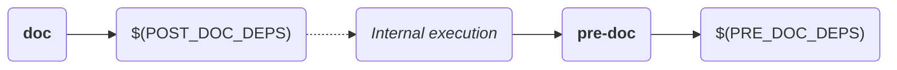

# doxygen.mk

This file provides standard targets to generate source documentation using [doxygen](https://www.doxygen.nl/index.html).

## Variables

Following are described all variables used/exported by this makefile:

> **Variable details**
>
> For each detailed variable, the following fields refer to:
>
> * **Description:** contains descriptive information about the variable.
> * **Mandatory:** defines if a variable must be defined during build.
> * **Default value:** contains the value which will be assumed if variable is optional and it is not defined.
> * **Allowed origins:** defines where variable is allowed to be defined (command line, environment, makefile, etc).
> * **Restrictions:** Contain information about restrictions on which kind of values that can be stored in the variable.

* **`DOC_DIR`**

  * **Description:** Defines the path of the directory (relative to [output base directory](#O)), which will contain generated documentation.
  * **Mandatory:** no
  * **Default value:** `doc`
  * **Allowed origins:** _(any)_.
  * **Restrictions:** Value shall not contain whitespaces nor can be an empty string.

* **`DOXYFILE`**

  * **Description:** Defines the path of the `Doxyfile` which will be parsed by doxygen.
  * **Mandatory:** no
  * **Default value:** `Doxyfile`
  * **Allowed origins:** _(any)_
  * **Restrictions:** Value shall not contain whitespaces nor can be an empty string.

* **`O`**

  * **Description:** Defines output base directory. All generated documentation will be placed nested to this directory.
  * **Mandatory:** no
  * **Default value:** `output`
  * **Allowed origins:** _(any)_
  * **Restrictions:** Value shall not contain whitespaces nor can be an empty string.

* **`O_DOC_DIR`**

  * **Description:** Read-only variable containing the final directory where generated documentation will be placed (`$(O)/$(DOC_DIR)`).
  * **Mandatory:** _(N/A)_
  * **Default value:** _(N/A)_
  * **Allowed origins:** _(N/A)_
  * **Restrictions:** This is a read-only variable. Its value is set by this makefile and cannot be modified.

* **`POST_DOC_DEPS`**

  * **Description:** Contains a list of targets to be called AFTER documentation is generated.
  * **Mandatory:** no
  * **Default value:** _(undefined)_
  * **Allowed origins:** makefile
  * **Restrictions:** Since variable is intended to hold a list of values (whitespace-delimited string), it is recommend to use the `+=` operator while adding values to the variable.

* **`PRE_DOC_DEPS`**

  * **Description:** Contains a list of targets to be called BEFORE documentation is generated.
  * **Mandatory:** no
  * **Default value:** _(undefined)_
  * **Allowed origins:** makefile
  * **Restrictions:** Since variable is intended to hold a list of values (whitespace-delimited string), it is recommend to use the `+=` operator while adding values to the variable.

## Make targets

The following diagram shows all targets exposed by this makefile and their dependencies:

> NOTE: Dashed lines represent execution of one target after another, and not a dependency between targets.

